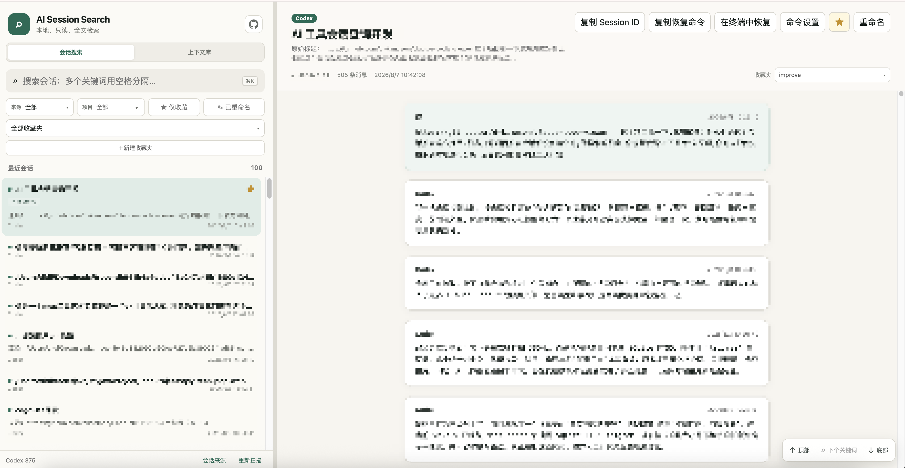

# AI Session Search

English | [简体中文](./README.zh-CN.md)

[](https://github.com/lililib/ai-session-search/releases)
[](./LICENSE)

A local-first app for searching AI coding sessions and saving reusable context. It discovers local
conversations from multiple coding tools and indexes natural language, code, paths, errors, titles,
and Session IDs with SQLite FTS5 trigram. Source sessions remain read-only.



## Features

- Full-text search across providers and projects, with Chinese, Japanese, Korean, English, and code substring support
- Multiple space-separated terms narrow results to sessions containing every term, even across different messages
- Context library for saving, searching, organizing, and copying complete AI context blocks
- Favorites, custom titles, collections, filters, and resizable navigation
- Copy Session IDs, customize resume commands, or resume directly in a supported terminal
- Background incremental indexing, filesystem watching, and configurable session-source paths
- Shared web/desktop data and automatic English/Simplified Chinese UI

No API key or cloud database is required. User metadata and indexes are stored only in the app's
own SQLite database.

## Desktop

Download a portable build from [GitHub Releases](https://github.com/lililib/ai-session-search/releases):

- macOS Apple Silicon: `darwin-arm64.zip`
- macOS Intel: `darwin-x64.zip`
- Windows 10/11 x64: `AI.Session.Search-win32-x64-<version>.zip`

Extract and run the app; Node.js is not required. Current builds are unsigned, so macOS Gatekeeper
or Windows SmartScreen may show a first-launch warning.

## Search syntax

Separate remembered terms with spaces to require all of them in the same session. Matches may occur
in different messages, titles, or the Session ID. Wrap a phrase containing spaces in quotes:

```text
push home-server
push "GitHub Actions" "home server"
35cb2091 deployment
```

## Supported clients

| ID | Client | Default home |
| --- | --- | --- |
| `claude` | Claude Code | `~/.claude` |
| `codex` | Codex | `~/.codex` |
| `antigravity` | Antigravity | `~/.gemini` |
| `opencode` | OpenCode | `~/.local/share/opencode` |
| `copilot` | GitHub Copilot CLI | `~/.copilot` |
| `cursor` | Cursor | `~/.cursor` |
| `kimi` | Kimi Code | `~/.kimi-code` |

Use **Session sources** to change paths or enable/disable clients without restarting. Saved UI
settings take precedence over CLI options, environment variables, and platform defaults.

## Web / CLI

Requires Node.js 24+ and pnpm 11:

```bash
corepack pnpm install
corepack pnpm build
corepack pnpm start
```

Open `http://localhost:3411`.

| Option | Environment | Default |
| --- | --- | --- |
| `-p, --port <port>` | `PORT` | `3411` |
| `-h, --hostname <hostname>` | `HOSTNAME` | `localhost` |
| `--claude-dir <path>` | `AI_SESSION_CLAUDE_HOME` / `CLAUDE_CONFIG_DIR` | `~/.claude` |
| `--codex-dir <path>` | `AI_SESSION_CODEX_HOME` / `CODEX_HOME` | `~/.codex` |
| `--provider-dir <provider=path>` | `AI_SESSION_<PROVIDER>_HOME` | Provider default |
| `--data-dir <path>` | `AI_SESSION_DATA_DIR` / `XDG_DATA_HOME` | Platform app data |
| `--providers <ids>` | `AI_SESSION_PROVIDERS` | `auto` |
| `--no-watch` | — | Watching enabled |

The shared default data directory is `~/Library/Application Support/ai-session-search` on macOS,
`%LOCALAPPDATA%\\ai-session-search` on Windows, and `~/.local/share/ai-session-search` on Linux.

## Development

```bash
corepack pnpm dev
corepack pnpm desktop:start
corepack pnpm desktop:make
corepack pnpm test
corepack pnpm typecheck
corepack pnpm build
```

## Acknowledgements

- Thanks to [LINUX DO](https://linux.do/) for the open-source sharing community.

The search architecture is inspired by and adapted from
[d-kimuson/claude-code-viewer](https://github.com/d-kimuson/claude-code-viewer). See
[NOTICE.md](./NOTICE.md). Licensed under the [MIT License](./LICENSE).
